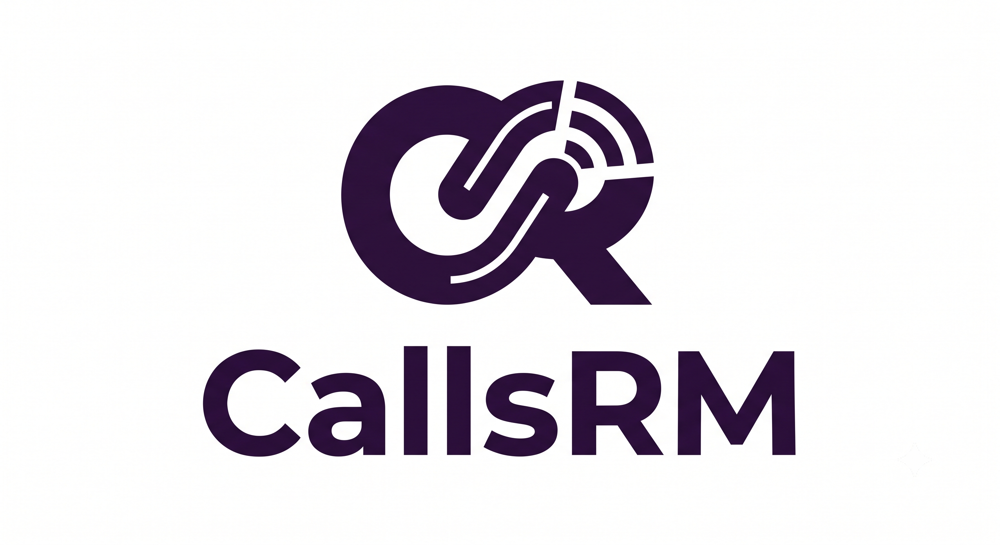

<p align="center">
  
</p>

# CallsRM

CallsRM is an open-source WhatsApp Business API CRM backend that captures messages and calls as first-class citizens. It receives Meta webhooks, persists conversations and calls in PostgreSQL, forwards events to n8n for automation, and allows agents to reply directly via the WhatsApp API — all secured with JWT authentication.

## The Problem

When building WhatsApp automations with n8n, you need a CRM as an intermediary between Meta and n8n to visualize and manage conversations. Most options are fully paid. Chatwoot is the most popular open-source alternative — but it has a critical gap.

Since July 2025, Meta's WhatsApp Business API supports native voice calls. Chatwoot receives these call webhooks in their Community Edition but silently ignores them — confirmed in their own codebase and GitHub issues. Their team stated that voice is an Enterprise-only feature (issue #11511, PR #13841 closed).

CallsRM fills that gap: an open-source CRM that handles both messages and calls natively, designed to work alongside n8n automations.

## Features

-  Capture incoming WhatsApp messages and persist them to PostgreSQL
-  Capture incoming WhatsApp calls — something Chatwoot Community Edition ignores
-  Forward events to n8n in real time for workflow automation
-  Send WhatsApp messages manually or via n8n automated responses
-  JWT authentication for agent endpoints
-  Layered architecture (routes → controller → service)
-  Unit tests with pytest
-  Postman collection included

## Stack

- **FastAPI** — async Python backend
- **PostgreSQL** — relational database
- **SQLModel** — ORM (SQLAlchemy + Pydantic)
- **Docker** — containerization

## Getting Started

```bash
cp .env.example .env
# fill in your credentials in .env
docker-compose up
```

## API Endpoints

| Method | Endpoint | Description |
|--------|----------|-------------|
| POST | `/webhooks` | Receive Meta webhook events |
| GET | `/health` | Health check |
| GET | `/contacts` | List all contacts (requires JWT) |
| GET | `/contacts/{id}/messages` | Message history for a contact (requires JWT) |
| GET | `/contacts/{id}/calls` | Call history for a contact (requires JWT) |
| GET | `/calls` | List all calls (requires JWT) |
| POST | `/messages/send` | Send WhatsApp message manually |
| POST | `/n8n/callback` | Receive automated responses from n8n (requires API key) |
| POST | `/auth/register` | Register a new agent |
| POST | `/auth/login` | Login and get JWT token |

## Roadmap

- [x] Receive and store incoming messages
- [x] Receive and store incoming calls
- [x] Auto-create contacts on first interaction
- [x] REST API to query contacts, messages and calls
- [x] Forward events to n8n in real time
- [x] Send WhatsApp messages via Meta API
- [x] POST /n8n/callback for automated responses
- [x] Layered architecture refactor (routes → controller → service)
- [x] Auth/JWT — register and login with JWT tokens
- [x] Response schemas (DTOs)
- [x] Unit tests with pytest
- [x] Postman collection
- [ ] Propagate Meta API errors in response (token expired, 24h window, invalid number, etc.)
- [ ] Live call handling via WebRTC (Meta Calling API)

## License

MIT